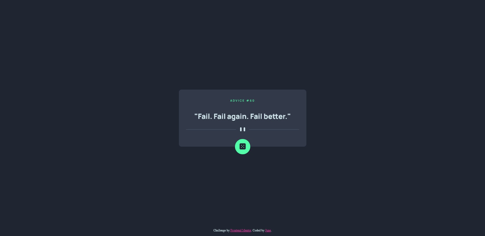

# Frontend Mentor - Advice generator app solution

This is a solution to the [Advice generator app challenge on Frontend Mentor](https://www.frontendmentor.io/challenges/advice-generator-app-QdUG-13db). Frontend Mentor challenges help you improve your coding skills by building realistic projects.

## Table of contents

- [Overview](#overview)
  - [The challenge](#the-challenge)
  - [Screenshot](#screenshot)
  - [Link](#link)
- [My process](#my-process)
  - [Built with](#built-with)
  - [What I learned](#what-i-learned)
  - [Useful resources](#useful-resources)

## Overview

### The challenge

The challenge is to build out an advice generator app using the [Advice Slip API](https://api.adviceslip.com) and get it looking as close to the design as possible. NOTE: This app works better in Chrome. Please wait at least 2 seconds before trying to generate a new piece of advice for the app to work properly.

Users should be able to:

- View the optimal layout for the app depending on their device's screen size
- See hover states for all interactive elements on the page
- Generate a new piece of advice by clicking the dice icon

### Screenshot



### Link

- Live Site URL: [Advice Generator](https://juneboom.github.io/advice-generator/)

## My process

### Built with

- Semantic HTML5 markup
- CSS custom properties
- Flexbox
- Mobile-first workflow

### What I learned

I'm happy I got the opportunity to use fetch in a project. Fetch has its own quirks regarding errors; this is how I chose to handle it:

```js
const getData = async (url) => {
  let data = await fetch(url)
    .then((response) => {
      if (!response.ok) throw new Error(`Status Code: ${response.status}`);

      return response.json();
    })
    .catch((err) => {
      console.log("Something went wrong with fetch");
      console.log(err);
    });
  return data;
};
```

### Useful resources

- [CSS Tricks](https://css-tricks.com/snippets/css/a-guide-to-flexbox/) - CSS Tricks is my go to resource for styling. If I ever have any doubts about how something will look using flex, I always go here.
